<div align="center">



</div>

<br>

<div align="center">

### `saransh@github:~$ ./contributions.sh`

</div>

<br>

<div align="center">

</div>

<br>

<div align="center">

### `saransh@github:~$ whoami`

</div>

<br>

<table>
<tr>
<td valign="top">

</td>

<td valign="top">

</td>
</tr>
</table>

<br>

<div align="center">

### `saransh@github:~$ cat stack.json`

</div>

<br>

<div align="center">

</div>

<br>

<div align="center">

### `saransh@github:~$ ls ./projects`

</div>

<br>

<div align="center">

</div>

<br>

<div align="center">

### `saransh@github:~$ ./current-project.sh`

</div>

<br>

<div align="center">

```
┌─────────────────────────────────────────────────────────────────┐
│ PROJECT: Sovereign AI Workbench                                 │
├─────────────────────────────────────────────────────────────────┤
│                                                                 │
│ MISSION                                                         │
│ Build a private, on-premise AI workspace                        │
│ that keeps AI workflows under your control.                     │
│                                                                 │
│ STACK                                                           │
│ React + Vite + Tailwind CSS                                     │
│ Python + FastAPI                                                │
│ Ollama + Open-weight LLMs                                       │
│ Vision / OCR                                                    │
│ Qdrant + SQLite                                                 │
│ Docker                                                          │
│                                                                 │
│ STATUS                                                          │
│ ████████████░░░░  Development                                   │
│                                                                 │
└─────────────────────────────────────────────────────────────────┘
```

</div>

<br>

<div align="center">

### `saransh@github:~$ ./current-focus.sh`

</div>

<br>

<div align="center">

</div>

<br>

<div align="center">

### `saransh@github:~$ ./connect.sh`

</div>

<br>

<div align="center">

```
┌────────────────────────────────────────────────────┐
│ ● ● ●   CONNECT                                    │
├────────────────────────────────────────────────────┤
│ GitHub    → saranshnimje                           │
│ LinkedIn  → /in/saranshnimje                       │
│ Portfolio → saranshnimje.github.io                 │
└────────────────────────────────────────────────────┘
```

</div>

<br>

<div align="center">

### `saransh@github:~$ exit`

```
connection closed.
```

</div>